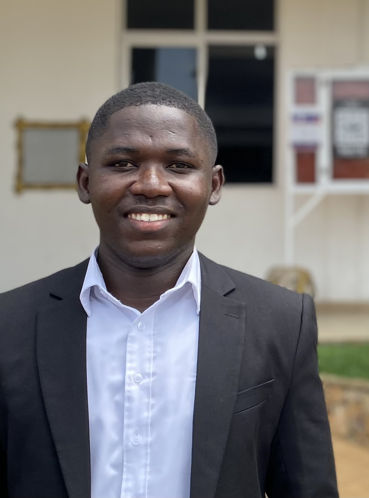

---
# Feel free to add content and custom Front Matter to this file.
# To modify the layout, see https://jekyllrb.com/docs/themes/#overriding-theme-defaults

layout: home
---

I am a PhD student in the [Geophysics Section](https://www.dias.ie/cosmicphysics/geophysics/) at [DIAS](https://www.dias.ie/) and advised by [Dr Emma L. Chambers](https://www.dias.ie/cosmicphysics/geophysics/geo-staff/geo-dr-emma-chambers/). 

My primary research interests are in seismic imaging and temperature modeling. I am interested in methods that integrate seismic observables with geochemistry and petrophysical information to understand geothermal systems.

Click [here](/assets/Angela_Gao_CV_F23.pdf) for a PDF of my CV.

# News

May 2026 - Presented at [EGU 26](https://www.egu26.eu) on my work with [Emma](https://www.dias.ie/cosmicphysics/geophysics/geo-staff/geo-dr-emma-chambers/), [Chris](https://www.dias.ie/cosmicphysics/geophysics/geo-staff/geo-chris-bean/), and [Kristín](https://en.vedur.is/about-imo/employees/persona/214/fyrirtaeki/2) on [Multi-scale imaging of Iceland](https://doi.org/10.5194/egusphere-egu26-7706).

February 2026 - **MOD3LTHERM** [abstract](https://doi.org/10.5194/egusphere-egu26-5714) has been accepted for [EGU 26](https://www.egu26.eu)!

February 2026 - **MOD3LTHERM** [abstract](https://doi.org/10.5194/egusphere-egu26-7706) has been accepted for [EGU 26](https://www.egu26.eu)! 

October 2025 - Participated in the [Computational Earth workshop](https://www.unige.ch/sciences/terre/en/groups/crustal-deformation-and-fluid-flow/snf-project) in Elba.

August 2025 - Awarded a travel grant under [SNF Sinergia project MIGRATE](https://data.snf.ch/grants/grant/209434) to attend the Computational Earth workshop in Elba.

April 2025 - Attended [EGU 2025](https://www.egu25.eu), for the first time!

February 2025 - **MOD3LTHERM** [abstract](https://doi.org/10.5194/egusphere-egu25-6881) has been accepted for [EGU 25](https://www.egu25.eu)!

September 2024 - Started my PhD at DIAS!
